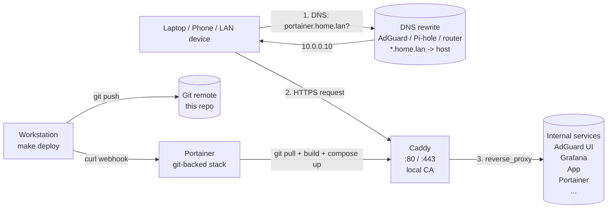

# caddy-stack

[](https://github.com/effecet/caddy-stack/actions/workflows/ci.yml)
[](LICENSE)
[](https://caddyserver.com)
[](https://www.portainer.io)
[](https://caddyserver.com/docs/automatic-https#local-https)

A small, reusable **Caddy reverse-proxy stack** that gives friendly `*.home.lan`
HTTPS names to the internal services running on a home server / Raspberry Pi
(`10.0.0.10` in the examples).

No more typing raw `10.0.0.10:<port>` URLs — just `https://portainer.home.lan`.
Caddy issues per-host certificates from its own **local CA**, and the whole stack
deploys via a **Portainer git-backed stack + webhook** (no SSH on the box).

> This is a template. Replace the domain (`home.lan`), the host IP (`10.0.0.10`),
> and the service blocks in the `Caddyfile` with your own.

## Architecture



## Service map

Friendly names only — upstream ports live solely in the `Caddyfile` (the single
source of truth) and `make info`. Run `make info` for the full hostname → upstream
mapping. The blocks shipped here are **examples**; swap in your own:

| Friendly name              | Example service   |
|----------------------------|-------------------|
| `adguard.home.lan`         | AdGuard Home UI   |
| `grafana.home.lan`         | Grafana           |
| `app.home.lan`             | Any HTTP app      |
| `portainer.home.lan`       | Portainer (HTTPS) |

## Project Structure

```
caddy-stack/
├── Caddyfile                   # all service routes, single source of truth
├── Dockerfile                  # FROM caddy:2-alpine + COPY Caddyfile (built per deploy)
├── docker-compose.yml          # build: . — :80/:443 + persistent /data, /config
├── Makefile                    # validate / up / down / deploy / logs / info
├── README.md                   # this file
├── .env.example                # template for PORTAINER_WEBHOOK
├── .gitignore                  # .env, .DS_Store
└── .github/workflows/ci.yml    # validate Caddyfile on push
```

## Quick start

### 1. DNS rewrite (one-time)

In your LAN DNS (AdGuard Home / Pi-hole / router) add a wildcard rewrite:

| Domain          | Answer        |
|-----------------|---------------|
| `*.home.lan`    | `10.0.0.10`   |

A single wildcard covers all current + future services.

### 2. Portainer git stack (one-time)

In Portainer (reachable at the host's LAN IP + Portainer HTTPS port for the very
first setup, before Caddy is running):

1. **Stacks → Add stack**
2. Name: `caddy`
3. Build method: **Repository**
4. Repository URL: `https://github.com/effecet/caddy-stack`
5. Reference: `refs/heads/main`
6. Compose path: `docker-compose.yml`
7. **Enable webhook** (toggle on) — copy the generated URL
8. **Deploy the stack**

Copy the webhook URL into `.env`:

```bash
cp .env.example .env
# Edit .env and paste the URL
```

### 3. Install Caddy's local root cert (one-time, per device)

After the first deploy, Caddy generates a local CA. Trust it on each device that
should see the green padlock:

1. In Portainer → Containers → caddy → **Console** (or File Browser on the
   `caddy_data` volume)
2. Read `/data/caddy/pki/authorities/local/root.crt`
3. Copy it to your device
4. macOS: double-click → Keychain Access → System → set to "Always Trust"

For iOS: AirDrop the `.crt` to your phone, install in Settings → General → VPN
& Device Management, then enable in Settings → General → About → Certificate
Trust Settings.

### 4. Daily use

```bash
make help        # list targets
make validate    # syntax-check Caddyfile (Docker, no Caddy install needed)
make deploy      # git push + trigger Portainer redeploy
make info        # show the service map
```

## Adding a new service

1. Edit `Caddyfile` — copy an existing block, change hostname and upstream.
2. `make validate` — confirm syntax.
3. `git add Caddyfile && git commit -m "feat: add <service>.home.lan"`
4. `make deploy`. Portainer pulls the new commit, rebuilds the caddy image
   (the `Caddyfile` is COPYed in at build time), and recreates the container.
5. Caddy auto-issues a new cert from its local CA; no DNS change needed
   (the wildcard rewrite covers it).

## Notes

- **Wildcard DNS, per-host certs.** DNS answers `*.home.lan` with a single A
  record; Caddy issues per-host certs from its local CA. This keeps each
  service's TLS scoped tightly.
- **Mostly HTTP upstreams; HTTPS only where needed.** Most LAN services serve
  plain HTTP. Caddy terminates TLS for the browser; the internal upstream leg
  doesn't need TLS, and the simpler scheme avoids the cert-verification dance.
  For an HTTPS-only upstream with a self-signed cert (e.g. Portainer), use the
  `https://` form with `tls_insecure_skip_verify` (see the Portainer block).
- **No SSH needed.** Deploys flow through Portainer's git-backed stack +
  webhook trigger — see `make deploy`.
- **Caddyfile is baked into the image, not bind-mounted.** Portainer git-stacks
  clone the repo into a path inside the Portainer container (`/data/compose/<id>/`).
  A naive bind mount of `./Caddyfile` would resolve to that path on the host's
  docker daemon — which doesn't share Portainer's filesystem namespace, so the
  daemon auto-creates a directory there and the file-onto-file mount fails.
  Building a custom image with `COPY Caddyfile /etc/caddy/Caddyfile` sidesteps
  the issue entirely: the build context is sent to the daemon as a tarball over
  the socket, no host-path resolution needed. Trade-off: each Caddyfile edit
  triggers a ~10s rebuild on deploy — acceptable for a config that changes
  rarely (only when adding a new internal service hostname).

## License

MIT — see [LICENSE](LICENSE).
