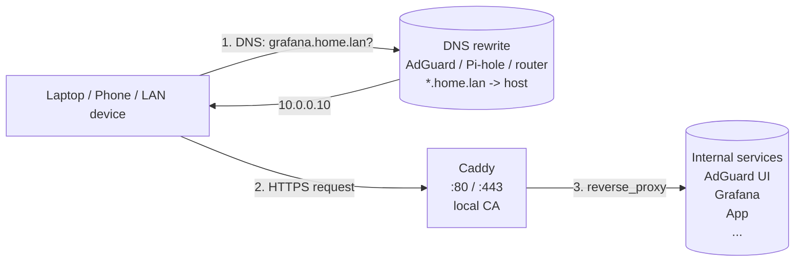

# caddy-stack

[](https://github.com/effecet/caddy-stack/actions/workflows/ci.yml)
[](LICENSE)
[](https://caddyserver.com)
[](https://caddyserver.com/docs/automatic-https#local-https)

A small, reusable **Caddy reverse-proxy stack** that gives friendly `*.home.lan`
HTTPS names to the internal services running on a home server / Raspberry Pi
(`10.0.0.10` in the examples).

No more typing raw `10.0.0.10:<port>` URLs — just `https://grafana.home.lan`.
Caddy issues per-host certificates from its own **local CA**, and the whole stack
runs with a single `docker compose up -d`.

> This is a template. Replace the domain (`home.lan`), the host IP (`10.0.0.10`),
> and the service blocks in the `Caddyfile` with your own.

## Architecture



## Service map

Friendly names only — upstream ports live solely in the `Caddyfile` (the single
source of truth) and `make info`. Run `make info` for the full hostname → upstream
mapping. The blocks shipped here are **examples**; swap in your own:

| Friendly name              | Example service   |
|----------------------------|-------------------|
| `adguard.home.lan`         | AdGuard Home UI   |
| `grafana.home.lan`         | Grafana           |
| `app.home.lan`             | Any HTTP app      |
| `portainer.home.lan`       | Portainer (HTTPS) |

## Project Structure

```
caddy-stack/
├── Caddyfile                   # all service routes, single source of truth
├── docker-compose.yml          # caddy:2-alpine, :80/:443, Caddyfile bind-mount + persistent /data, /config
├── Dockerfile                  # optional: bakes the Caddyfile into an image (for the Portainer path)
├── Makefile                    # validate / up / down / reload / deploy / info
├── README.md                   # this file
├── .env.example                # template for the optional PORTAINER_WEBHOOK
├── .gitignore                  # .env, .DS_Store
└── .github/workflows/ci.yml    # validate Caddyfile on push
```

## Quick start

### 1. DNS rewrite (one-time)

In your LAN DNS (AdGuard Home / Pi-hole / router) add a wildcard rewrite:

| Domain          | Answer        |
|-----------------|---------------|
| `*.home.lan`    | `10.0.0.10`   |

A single wildcard covers all current + future services.

### 2. Bring up the stack

```bash
make validate    # syntax-check the Caddyfile (Docker, no Caddy install needed)
make deploy      # docker compose up -d
```

That's it — Caddy is now serving every `*.home.lan` name in the `Caddyfile`.

### 3. Install Caddy's local root cert (one-time, per device)

After the first run, Caddy generates a local CA. Trust it on each device that
should see the green padlock. The cert lives in the `caddy_data` volume at
`/data/caddy/pki/authorities/local/root.crt`:

```bash
# Copy the root cert out of the running container
docker compose cp caddy:/data/caddy/pki/authorities/local/root.crt ./caddy-local-ca.crt
```

- **macOS:** double-click `caddy-local-ca.crt` → Keychain Access → System → set to "Always Trust"
- **iOS:** AirDrop the `.crt` to your phone, install in Settings → General → VPN
  & Device Management, then enable in Settings → General → About → Certificate
  Trust Settings

### 4. Daily use

```bash
make help        # list targets
make validate    # syntax-check Caddyfile
make reload      # hot-reload the Caddyfile (no downtime)
make info        # show the service map
```

## Adding a new service

1. Edit `Caddyfile` — copy an existing block, change hostname and upstream.
2. `make validate` — confirm syntax.
3. `make reload` — Caddy picks up the new route with zero downtime.
4. Caddy auto-issues a new cert from its local CA; no DNS change needed
   (the wildcard rewrite covers it).

## Notes

- **Wildcard DNS, per-host certs.** DNS answers `*.home.lan` with a single A
  record; Caddy issues per-host certs from its local CA. This keeps each
  service's TLS scoped tightly.
- **Mostly HTTP upstreams; HTTPS only where needed.** Most LAN services serve
  plain HTTP. Caddy terminates TLS for the browser; the internal upstream leg
  doesn't need TLS, and the simpler scheme avoids the cert-verification dance.
  For an HTTPS-only upstream with a self-signed cert (e.g. Portainer), use the
  `https://` form with `tls_insecure_skip_verify` (see the `portainer.home.lan`
  block in the `Caddyfile`).
- **Caddyfile is bind-mounted.** `docker-compose.yml` mounts `./Caddyfile`
  read-only into the container, so edits land instantly — `make reload` applies
  them with no downtime and no rebuild.

## Optional: GitOps deploy via Portainer

If you run [Portainer](https://www.portainer.io) and prefer a git-backed,
no-SSH deploy, the repo also ships a `Dockerfile` and a `make deploy-portainer`
target for that workflow.

1. In Portainer: **Stacks → Add stack**, name `caddy`, build method
   **Repository**, URL `https://github.com/effecet/caddy-stack`, reference
   `refs/heads/main`, compose path `docker-compose.yml`, **enable the webhook**,
   then deploy.
2. Copy the webhook URL into `.env` (`cp .env.example .env`).
3. `make deploy-portainer` pushes to git and triggers the webhook.

> **One gotcha if you go this route:** Portainer git-stacks clone the repo into
> a path *inside the Portainer container*, so a bind mount of `./Caddyfile`
> resolves against the host docker daemon — which doesn't share Portainer's
> filesystem namespace, and the file-onto-file mount fails. For the Portainer
> path, swap the compose `image: caddy:2-alpine` + Caddyfile volume for
> `build: .` so the included `Dockerfile` bakes the Caddyfile into the image
> (`COPY Caddyfile /etc/caddy/Caddyfile`). Trade-off: each edit triggers a
> ~10s rebuild on deploy — fine for config that changes rarely.

## License

MIT — see [LICENSE](LICENSE).
